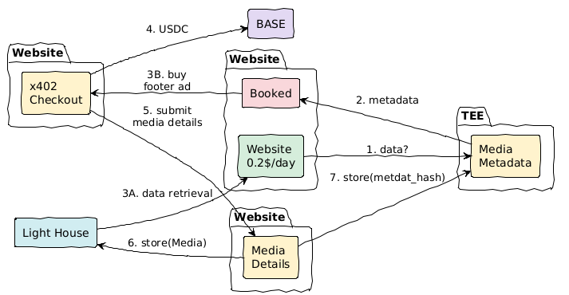

# 🚀 AxonLayer - Onchain Advertising Platform

> **A comprehensive Web3 advertising ecosystem built on Base network with OnchainKit integration, featuring gas-free transactions, decentralized storage, and competitive bidding for transparent ad slot management.**

## 🎯 **What is AxonLayer?**

AxonLayer is a complete **onchain advertising platform** that revolutionizes how publishers monetize their websites and how advertisers purchase ad space. Built for the modern Web3 era on Base network, it combines:

- **🔗 Base Network Integration**: Native USDC support with gas-free transactions
- **⚡ OnchainKit Integration**: Seamless wallet connection and transaction management
- **🌐 Decentralized Storage**: IPFS storage via Lighthouse for persistent ad content
- **⚡ Competitive Bidding**: Real-time bidding system for ad slots
- **📱 Modern UI**: Beautiful, responsive interface with Web3 integration
- **🛠️ Developer SDKs**: Easy integration for any website with multiple SDK options

## 🏆 **Key Features**

This project demonstrates a **complete Web3 advertising solution** featuring:
- **Full-stack development** with Next.js 15 and TypeScript
- **Base network integration** with native USDC and gas sponsorship
- **OnchainKit integration** for seamless wallet connectivity
- **Decentralized storage** using IPFS and Lighthouse
- **Production-ready deployment** with comprehensive SDKs
- **Developer-friendly integration** with multiple SDK options

## 🏗️ **Architecture Overview**




```
┌─────────────────┐    ┌─────────────────┐    ┌─────────────────┐
│   Frontend      │    │   Payment       │    │   Storage       │
│   (Next.js)     │◄──►│   (X402/USDC)   │◄──►│   (IPFS/LH)     │
│   React App     │    │   Blockchain    │    │   Decentralized │
└─────────────────┘    └─────────────────┘    └─────────────────┘
         │                       │                       │
         ▼                       ▼                       ▼
┌─────────────────┐    ┌─────────────────┐    ┌─────────────────┐
│   Ad402 SDK     │    │   API Routes    │    │   Queue System  │
│   Integration   │    │   Serverless    │    │   Bidding       │
└─────────────────┘    └─────────────────┘    └─────────────────┘
```

## 📁 **Project Structure**

```
axonlayer/
├── 🎨 app/                          # Main Next.js Application (Frontend)
│   ├── app/                         # App Router Pages
│   │   ├── ads/                     # Ad management interface
│   │   ├── blog/                    # Blog content
│   │   ├── checkout/                # Payment & bidding interface
│   │   ├── dashboard/               # Publisher analytics
│   │   ├── example-ads/             # Demo ad slots
│   │   ├── test-ads/                # Testing interface
│   │   ├── test-upload/             # Upload testing
│   │   ├── upload/                  # Ad content upload page
│   │   └── components/              # Shared components
│   ├── components/                  # React Components
│   │   ├── OnchainKitIdentity.tsx   # Identity components
│   │   ├── OnchainKitWallet.tsx    # Wallet connection
│   │   ├── WalletConnectModal.tsx   # Web3 wallet integration
│   │   └── ui/                      # UI component library
│   ├── lib/                         # Core Libraries
│   │   ├── lighthouse.ts            # IPFS storage system
│   │   ├── adService.ts             # Ad management services
│   │   ├── usdc.ts                  # USDC payment utilities
│   │   └── walletUtils.ts           # Wallet utilities
│   └── hooks/                       # Custom React hooks
├── 📦 axon-sdk/                     # Main AxonLayer SDK Package
│   ├── src/                         # SDK Source Code
│   │   ├── components/              # React components
│   │   │   ├── AdProvider.tsx       # Main provider
│   │   │   └── AdSlot.tsx           # Ad slot component
│   │   ├── types/                   # TypeScript types
│   │   └── utils/                   # Utility functions
│   ├── examples/                    # Integration examples
│   └── dist/                        # Built SDK package
├── ⚡ facilitator-api/              # Payment Facilitator Service
│   ├── index.ts                     # Main service file
│   └── package.json                 # Service dependencies
└── 🔧 service/                      # Hash Storage Service
    ├── src/                         # Service source code
    │   ├── firebase.ts              # Firebase configuration
    │   ├── index.ts                 # Main service file
    │   ├── routes/                  # API routes
    │   └── types.ts                 # TypeScript definitions
    └── package.json                 # Service dependencies
```
### 🔗 **Links**
- **Website**: [https://axonlayer.vercel.app](https://axonlayer.vercel.app)
- **AxonLayer SDK**: [npmjs.com/package/axon-sdk](https://www.npmjs.com/package/axon-sdk)

## 🚀 **Key Features**

### 💰 **Payment System**
- **Base Network USDC**: Native USDC support (0x833589fcd6edb6e08f4c7c32d4f71b54bda02913)
- **Gas-Free Transactions**: All transactions sponsored by Base network
- **OnchainKit Integration**: Seamless wallet connection and transaction management
- **Multi-wallet Support**: MetaMask, Coinbase Wallet, WalletConnect, and more
- **Base Network**: Fast, low-cost transactions with 2-second block times

### 🎯 **Ad Slot Management**
- **Predefined Sizes**: Banner (728x90), Square (300x250), Mobile (320x60), Sidebar (160x600)
- **Categories**: Technology, General, Demo slots
- **Real-time Status**: Live ad availability and expiration
- **Automatic Expiration**: Time-based ad lifecycle management

### ⚡ **Bidding System**
- **Available Slots**: Immediate purchase at base price
- **Occupied Slots**: Competitive bidding for next available slot
- **Queue Management**: Higher bids get priority
- **Automatic Activation**: Ads activate when current ad expires

### 🌐 **Decentralized Storage**
- **IPFS Integration**: All ads stored on IPFS via Lighthouse
- **Persistent Storage**: Data survives server restarts and deployments
- **Global Distribution**: Content delivered from IPFS network
- **30-second Cache**: Optimized performance with caching

## 📦 **AxonLayer SDKs**

AxonLayer provides multiple SDK options for different use cases:

### 🎯 **AxonLayer SDK (Recommended)**

The main AxonLayer SDK with OnchainKit integration and Base network support:

```tsx
// 1. Install the SDK
npm install axon-sdk

// 2. Wrap your app with AdProvider
import { AdProvider, AdSlot } from 'axon-sdk';

export default function RootLayout({ children }) {
  return (
    <AdProvider
      config={{
        websiteId: 'your-website-id',
        walletAddress: '0x742d35Cc6634C0532925a3b8D4C9db96C4b4d8b6',
        apiBaseUrl: 'https://api.axonlayer.com',
      }}
      onchainKitApiKey="your_onchainkit_api_key"
      walletConnectProjectId="your_walletconnect_project_id"
    >
      {children}
    </AdProvider>
  );
}

// 3. Add ad slots to your pages
export default function HomePage() {
  return (
    <div>
      <h1>Welcome to My Website</h1>
      
      {/* Header banner ad */}
      <AdSlot
        slotId="header-banner"
        size="banner"
        price="0.10"
        clickable={true}
      />
      
      <main>
        <p>Your content here...</p>
      </main>
      
      {/* Sidebar ad */}
      <AdSlot
        slotId="sidebar-ad"
        size="sidebar"
        price="0.05"
        clickable={true}
      />
    </div>
  );
}
```


### 🔧 **Available Ad Slot Sizes**

| Size | Dimensions | Best For |
|------|------------|----------|
| **banner** | 728x90px | Headers, footers |
| **square** | 300x250px | Sidebars, mid-content |
| **mobile** | 320x60px | Mobile devices |
| **sidebar** | 160x600px | Vertical sidebars |
| **card** | 300x200px | Content cards (AxonLayer SDK) |
| **leaderboard** | 970x90px | Wide banners (AxonLayer SDK) |

## 🛠️ **Technical Implementation**

### 🔗 **Blockchain Integration**
- **Base Network**: Native USDC support with gas-free transactions
- **OnchainKit Integration**: Seamless wallet connection and transaction management
- **Paymaster Integration**: All transactions sponsored by Base network
- **Multi-wallet Support**: MetaMask, Coinbase Wallet, WalletConnect, and other Web3 wallets

### 🌐 **Storage Architecture**
- **Lighthouse/IPFS**: Decentralized storage for all ad content
- **HTTP-based Storage**: Eliminates native module dependencies
- **Persistent Data**: Survives serverless function invocations
- **Global CDN**: Content delivered from IPFS network

### ⚡ **API Endpoints**

**Frontend API (Next.js App Router):**
- `GET /api/ads/[slotId]` - Retrieve active ad for slot
- `POST /api/upload-ad` - Upload new ad placement
- `GET /api/queue-info/[slotId]` - Get bidding queue information
- `POST /api/analytics/ad-view` - Track ad views
- `POST /api/analytics/ad-click` - Track ad clicks
- `GET /api/health` - System health monitoring

**Hash Service API (Firebase):**
- `POST /hashes` - Store ad hash records
- `GET /hashes/:index` - Retrieve hash by ID
- `GET /hashes?index=<id>` - Retrieve hash by query parameter

**Facilitator API (Payment Processing):**
- Payment processing and transaction facilitation
- X402 protocol integration for micropayments

## 🚀 **Getting Started**

### 📋 **Prerequisites**
- Node.js 18+
- OnchainKit API key
- WalletConnect Project ID
- Lighthouse.storage API key (for IPFS storage)
- Web3 wallet (MetaMask, Coinbase Wallet, etc.)
- USDC on Base network

### 🔧 **Local Development**

```bash
# Clone the repository
git clone https://github.com/hatif03/axonlayer.git
cd axonlayer

# Install dependencies for the main app
cd app
npm install

# Set up environment variables
cp env.example .env.local
# Add your API keys:
# NEXT_PUBLIC_ONCHAINKIT_API_KEY=your_onchainkit_api_key
# NEXT_PUBLIC_WALLETCONNECT_PROJECT_ID=your_walletconnect_project_id
# LIGHTHOUSE_API_KEY=your_lighthouse_api_key

# Start development server
npm run dev
```

### 📦 **SDK Development**

**AxonLayer SDK:**
```bash
# Navigate to AxonLayer SDK directory
cd axon-sdk

# Install dependencies
npm install

# Build the SDK
npm run build

# Watch for changes during development
npm run dev
```

### 🌐 **Production Deployment**

#### **Vercel Deployment (Recommended)**

1. **Connect Repository**: Link your GitHub repo to Vercel
2. **Set Environment Variables**:
   ```bash
   LIGHTHOUSE_API_KEY=your_lighthouse_api_key_here
   ```
3. **Deploy**: Vercel auto-detects Next.js and deploys
4. **Verify**: Test ad creation and persistence

#### **Environment Variables**

```bash
# Required for production
NEXT_PUBLIC_ONCHAINKIT_API_KEY=your_onchainkit_api_key_here
NEXT_PUBLIC_WALLETCONNECT_PROJECT_ID=your_walletconnect_project_id_here
LIGHTHOUSE_API_KEY=your_lighthouse_api_key_here

# Optional - for existing data
LIGHTHOUSE_STORAGE_HASH=your_existing_ipfs_hash
```

## 🎨 **UI/UX Design**

### 🎯 **Design Philosophy**
- **Modern & Minimalistic**: Clean, professional appearance
- **Monospaced Typography**: JetBrains Mono for digital aesthetic
- **Sharp Edges**: No border-radius for crisp, technical look
- **Black/White/Gray Palette**: High contrast, accessible design
- **Responsive**: Optimized for all device sizes

### 🧩 **Key Components**
- **AdSlot (AxonLayer SDK)**: Main ad slot component with OnchainKit integration
- **Ad402Slot (Legacy SDK)**: Legacy ad slot component with bidding integration
- **OnchainKitIdentity**: Identity display components
- **OnchainKitWallet**: Wallet connection components
- **Checkout Page**: Streamlined payment and bidding interface
- **Upload Page**: Simple ad content upload with progress tracking
- **Dashboard**: Publisher analytics and slot management

## 🔒 **Security Features**

- **Blockchain Payments**: Immutable payment records on-chain
- **IPFS Storage**: Decentralized, tamper-proof ad storage
- **Wallet Integration**: Secure Web3 authentication
- **Rate Limiting**: API protection against abuse
- **Input Validation**: Comprehensive data sanitization
- **CORS Protection**: Proper cross-origin resource sharing

## 📊 **Analytics & Monitoring**

- **Ad Performance**: Click tracking and view analytics
- **Revenue Tracking**: Payment and bidding analytics
- **Queue Management**: Bidding system performance metrics
- **Storage Monitoring**: IPFS storage health and performance
- **Real-time Updates**: Live ad status and queue information

## 🧪 **Testing**

### 🎯 **Test Endpoints**
- `/api/test-expiration` - Create test ads with custom expiration
- `/example-ads` - Demo page with all slot types
- `/test-ads` - Development testing interface

### 🔍 **Test Scenarios**
1. **Ad Creation**: Upload and display ads
2. **Bidding System**: Test queue management and priority
3. **Expiration**: Verify automatic ad expiration
4. **Persistence**: Confirm data survives server restarts
5. **Payment Flow**: Test USDC transactions

## 🌟 **Production Features**

### ⚡ **Scalability**
- **Serverless Architecture**: Auto-scaling with Vercel
- **IPFS Distribution**: Global content delivery
- **Caching Strategy**: Optimized performance with 30s cache
- **Queue Management**: Efficient bidding system

### 🛡️ **Reliability**
- **Decentralized Storage**: No single point of failure
- **Automatic Failover**: Graceful error handling
- **Data Persistence**: Survives deployments and restarts
- **Real-time Updates**: Live queue and ad status

## 📈 **Future Enhancements**

- **Multi-chain Support**: Ethereum, Arbitrum, Optimism
- **Advanced Analytics**: Detailed performance metrics
- **A/B Testing**: Ad content optimization
- **Mobile App**: Native mobile applications
- **API Marketplace**: Third-party integrations
- **AI-powered Targeting**: Smart ad placement
- **NFT Integration**: Unique ad experiences
- **Enhanced OnchainKit Features**: Additional Base network integrations
- **Gas Optimization**: Further transaction cost reductions

## 🤝 **Contributing**

We welcome contributions! Here's how to get started:

1. **Fork the repository**
2. **Create a feature branch**: `git checkout -b feature/amazing-feature`
3. **Make your changes**: Follow our coding standards
4. **Test thoroughly**: Ensure all tests pass
5. **Submit a pull request**: Describe your changes clearly

### 🎯 **Development Guidelines**
- Use TypeScript for all new code
- Follow the existing code style
- Add tests for new features
- Update documentation as needed
- Ensure mobile responsiveness

## 📄 **License**

This project is licensed under the **MIT License** - see the [LICENSE](LICENSE) file for details.


## 🎉 **Ready to Get Started?**

**For Publishers**: Integrate the AxonLayer SDK into your website and start earning from ad slots with gas-free transactions.

**For Advertisers**: Purchase ad space with Base USDC and reach your target audience through our onchain platform.

**For Developers**: Build on top of our open-source platform and contribute to the future of onchain advertising.

---

**AxonLayer** - *Revolutionizing digital advertising through onchain technology and Base network integration.* 🚀

*Built with ❤️ for the Web3 community on Base network*
